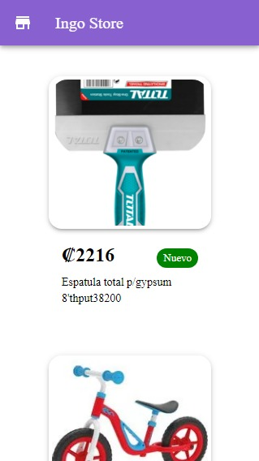

# <div align="center">Ingo Store :octocat:</div>
### <div align="center">Demo de la App :fire: !!</div>


#### Desktop
<div class="row" align="center">
  
</div>

#### Tablet
<div class="row" align="center">
  
</div>

#### Mobile
<div class="row" align="center">
  
</div>


## How to run the project ?

Dependencies must be installed first
```
npm install
```

Command To start the project
```
npm start
```

## Then when compiling you can view the page in one of the following paths
```
http://localhost:3000
http://localhost:3000/home
```

### <div align="center"> Show some ❤️ by starring some of the repositories! </div>
