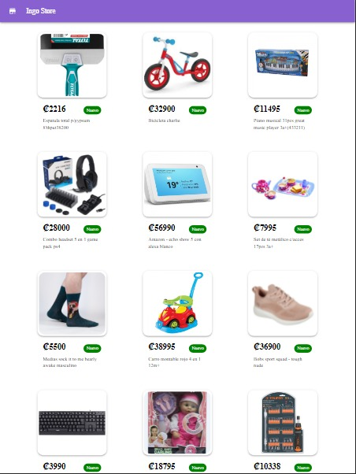

# Ingo Store :octocat:
### <div align="center">Demo de la App :fire: !!</div>


#### <div align="center">Desktop :computer:</div>
<div class="row" align="center">
  
</div>

#### <div align="center">Tablet :octocat:</div>
<div class="row" align="center">
  
</div>

#### <div align="center">Mobile :iphone:</div>
<div class="row" align="center">
  
</div>


## How to run the project ? :collision:

Dependencies must be installed first :heavy_check_mark:
```
npm install
```

Command To start the project :rocket: :rocket:
```
npm start
```

## Then when compiling you can view the page in one of the following paths :newspaper: :point_down:
```
http://localhost:3000
http://localhost:3000/home
```

### <div align="center"> Show some ❤️ by starring some of the repositories! </div>
